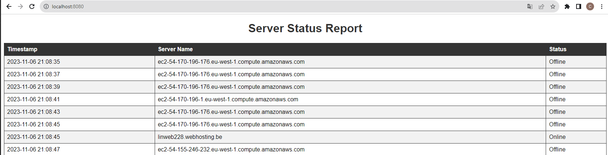

# PythonAdvancedLabo6

# Setup
1. python -m venv venv
2. venv/Scripts/activate
3. pip install -r requirements.txt
4. cd src

# Werking

1. python main.py management
    * hier kan je servers via ip of hostname toevoegen, verwijderen of de lijst tonen

2. python main.py check
    * ping naar de servers en log dit en laat de logs in een html bestand zien

    